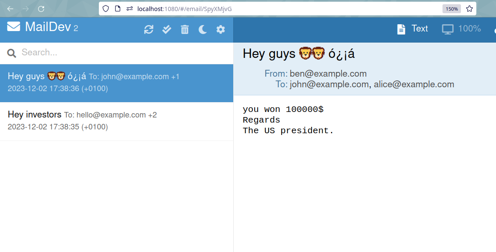
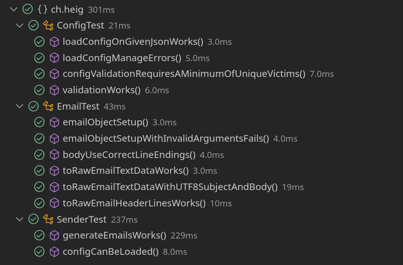

# Labo SMTP - DAI
Groupe: Leonard Klasen et Samuel Roland

## Objectif
Le but de ce laboratoire est de se familiariser avec le protocole SMTP en écrivant un programme Java permettant d'envoyer une campagne d'emails pranks (de blagues). Le but est d'interagir directement avec un serveur SMTP via des sockets TCP Java, sans aide de librairie pour implémenter l'envoi d'emails en SMTP.

**Note: ce projet est fait uniquement dans un but d'apprentissage et ne doit jamais être utilisé sur un vrai serveur SMTP. Nous utilisons ici un serveur mock (MailDev) qui permet de simuler l'envoi d'emails vers un serveur réel.**

## Configuration
La liste des adresses emails des victimes se trouvent dans `victims.json` et la liste des emails de pranks sont dans `messages.json`. Ces 2 fichiers de configurations doivent rester dans leur format actuel et doivent être du JSON valide. Il doit y avoir minimum 5 adresses emails uniques de victimes.

## Exécution
Pour lancer le serveur MailDev, on peut le faire avec Docker:
```
docker run -d -p 1080:1080 -p 1025:1025 maildev/maildev
```

À cette étape, il est déjà possible d'ouvrir l'interface web de MailDev dans un navigateur sur `localhost:1080`.

Pour lancer notre programme, il faut déjà cloner ce repository:
```
git clone https://github.com/G-LK/dai-lab-smtp.git
cd dai-lab-smtp
```

Il faut d'abord le compiler (avec Maven):
```
mvn package
```

*Note: Grâce au plugin `maven-shade-plugin` ce paquet contient également toutes les dépendances, la libraire Google Gson n'était pas trouvée par défaut.*

Si nécessaire, il est possible de changer la liste des victimes (`victims.json`) et des messages (`messages.json`).

Et pour lancer le fichier `.jar` créé sous target, il suffit de lancer:
```
java -jar target/smtp-1.0.jar <number of groups>
```

Où `<number of groups>` est un nombre positif de groupes souhaités. Chaque groupe recevra un email et est composé de 2 à 5 adresses de victimes. Une de ces adresses sera utilisée comme expéditeur. Un message est choisi au hasard parmi la liste et utilisé comme sujet et corps de l'email.

Dans la console, on verra les étapes de la campagne et le détail de communication entre notre client et le serveur.

Dans l'interface web de MailDev, on devrait ensuite voir les emails attendus reçus !

### Exemples
En lançant notre programme pour 2 groupes (les différentes étapes se lancent toutes à la suite, mais sont expliquées en plusieurs blocs ici):
```
$ java -jar target/smtp-1.0.jar 2
```

On voit que 2 emails différents ont été générés dont un contenant des émojis. L'entête contient `Hey guys 🦁🦁 ó¿¡á` a bien été encodé en Base64 `SGV5IGd1eXMg8J+mgfCfpoEgw7PCv8Khw6E=`:
```
>> Starting fake emails campaign...

>> Preparing the 2 emails, senders and recipients. (With messages.json and victims.json)
Generated emails:
- Email 'Hey investors' from <hey@example.com> to <hello@example.com> <alice@example.com> <john@example.com> 
- Email 'Hey guys 🦁🦁 ó¿¡á' from <ben@example.com> to <john@example.com> <alice@example.com> 
```

On se connecte sur `localhost:1025` (au serveur MailDev) et on envoie `ehlo`:
```
>> Preparation done. Establishing connection on localhost:1025 and starting campaign...
S: 220 6e12ab615990 ESMTP
C: ehlo localhost
S: 250-6e12ab615990 Nice to meet you, [172.17.0.1]
S: 250-PIPELINING
S: 250-8BITMIME
S: 250 SMTPUTF8
```

Les emails sont envoyés l'un après l'autre:
```
>>>> Sending email 1
C: MAIL FROM:<hey@example.com>
S: 250 Accepted
C: RCPT TO:<hello@example.com>
S: 250 Accepted
C: RCPT TO:<alice@example.com>
S: 250 Accepted
C: RCPT TO:<john@example.com>
S: 250 Accepted
C: DATA
S: 354 End data with <CR><LF>.<CR><LF>
C: From: <hey@example.com>
To: <hello@example.com>, <alice@example.com>, <john@example.com>
Subject: =?utf-8?B?SGV5IGludmVzdG9ycw==?=
Content-Type: text/plain; charset=utf-8

I have a great deal for you
Regards
The US president.
.
S: 250 Message queued as BiHHaqyC

>>>> Sending email 2
C: MAIL FROM:<ben@example.com>
S: 250 Accepted
C: RCPT TO:<john@example.com>
S: 250 Accepted
C: RCPT TO:<alice@example.com>
S: 250 Accepted
C: DATA
S: 354 End data with <CR><LF>.<CR><LF>
C: From: <ben@example.com>
To: <john@example.com>, <alice@example.com>
Subject: =?utf-8?B?SGV5IGd1eXMg8J+mgfCfpoEgw7PCv8Khw6E=?=
Content-Type: text/plain; charset=utf-8

you won 100000$
Regards
The US president.
.
S: 250 Message queued as SpyXMjvG
```

C'est la fin on envoie `quit`, la connexion est fermée par le serveur et le programme se termine.
```
C: quit
S: 221 Bye

>> Campaign done !
```

Dans l'interface de MailDev, on voit que nos 2 emails sont bien arrivés et que le sujet est correctement décodé.


## Fonctionnement
Nous avons défini les constantes suivantes au début de `Main` afin de centraliser la configuration du programme si des changements sont nécessaires:
```java
// Constants of the program
final static String SMTP_HOST = "localhost";
final static int SMTP_PORT = 1025;
static final int MIN_VICTIM_PER_GROUP = 2;
static final int MAX_VICTIMS_PER_GROUP = 5;
final static String VICTIMS_FILE = "victims.json";
static final String MESSAGES_FILE = "messages.json";
```

Voici déjà un diagramme de classe pour avoir une idée du fonctionnement:
TODO: generate Mermaid diagram

**En résumé, notre programme suit les étapes suivantes:**
1. `Main` crée un objet `Sender` 
   1. Vérifie la validité du premier paramètre passé au constructeur (entier positif non nul)
   1. L'objet `config` contient la configuration une fois chargée depuis les 2 fichiers
   1. Il valide la configuration et affiche des erreurs si nécessaire
1. `Main` appelle ensuite successivement les 2 étapes et s'arrête en cas de retour `false`, qui signifie qu'il y a eu une erreur et que le programme doit s'arrêter. Les exceptions sont également catchées.
   1. `Main` appelle `Sender.prepare()` pour préparer le serveur en lançant la génération les emails (objets `Email` créés aléatoirement à l'aide la configuration) en s'assurant d'avoir des adresses uniques. Il affiche dans la console les emails générés.
   1. `Main` appelle `Sender.connectAndSend()`, pour qu'il cherche à se connecter sur le port `1025` sur l'hôte `localhost` et génère une erreur s'il n'arrive pas s'y connecter. Une fois la connexion est établie, il peut envoyer les emails l'un après l'autre. Après chaque écriture il consomme les lignes des réponses du serveur jusqu'à trouver une ligne sans tirer.
      1. On lit le message d'intro du serveur
      1. On envoie `ehlo`
      1. Pour chaque email
         1. On envoie une à une les lignes d'introduction de l'email générée avec `Email.toRawEmailHeaderLines()` (`MAIL FROM`, etc) incluant les `\r\n`.
         1. On envoie d'un coup le contenu de l'email généré avec `Email.toRawEmailTextData()` (`From:`, `Subject:`, etc) incluant ses entêtes et son corps et le point final, incluant les `\r\n`.
      1. On envoie `quit`
1. Fin du programme

### Tests
Nous avons écrit de nombreux tests unitaires avec JUnit et architecturé notre programme de façon à faciliter leurs écritures (voir diagramme de classe).



Nous n'avons pas écrit de tests d'intégration donc les tests de gestion de certaines erreurs (configuration, paramètre 1 du CLI, ...) et les tests d'envoi final des emails se sont fait à la main.
